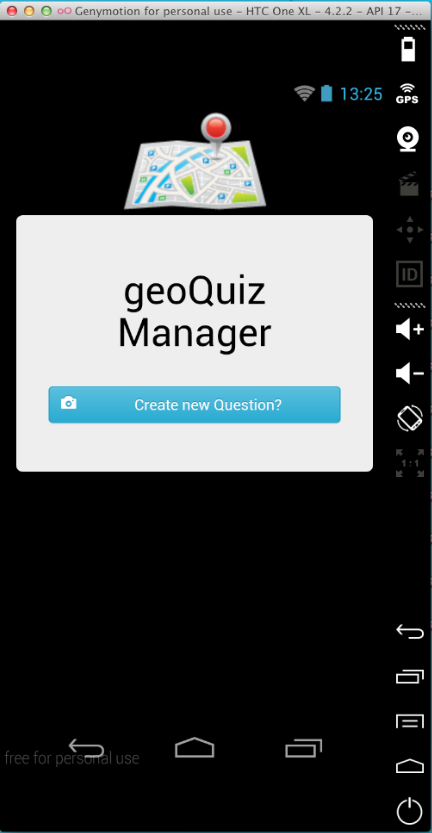
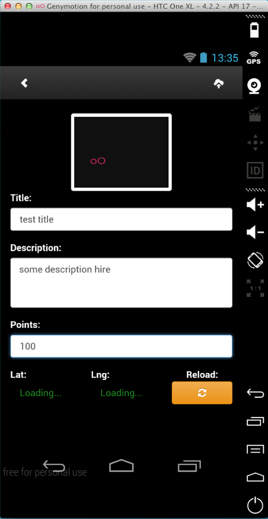

<h3>Android - PhoneGap HTML5 - WebApp<h3>
<h1>geoQuizManager</h1>
Based on: 
Logic - BackBone.js 
UI - bootStrap.js 
[camera/file/file-transfer/dialogs/network-Information/geoLocation] - PhoneGap Plugins
 

 
 
<h2>Notice</h2>
For iOS you must: 
1) copy folder "assets/www" into your project 
2) copy icons from "res/drawable" dir into your project and change it name with Apple icon rules. For example: icon@72x.png  

